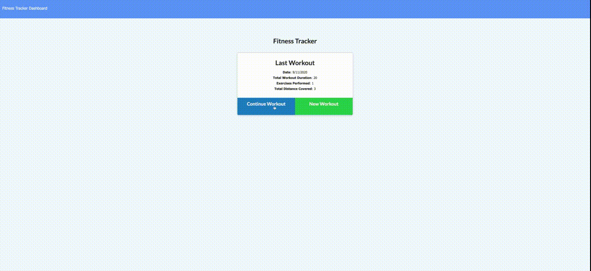

# Fitness Tracker

## Description

With this app the user will be able to track two different types of workouts (resistance / cardio). They will be able to input specific information about each type of workout ex: Bench Press, 175lbs, 5 sets, 10 reps, 10 mins. The information will be stored in a database and pushed to a graph on their dashboard.

## Required downloads

express, mongoose

## Deployed Link

https://mysterious-tor-01740.herokuapp.com/

## Screengrab

